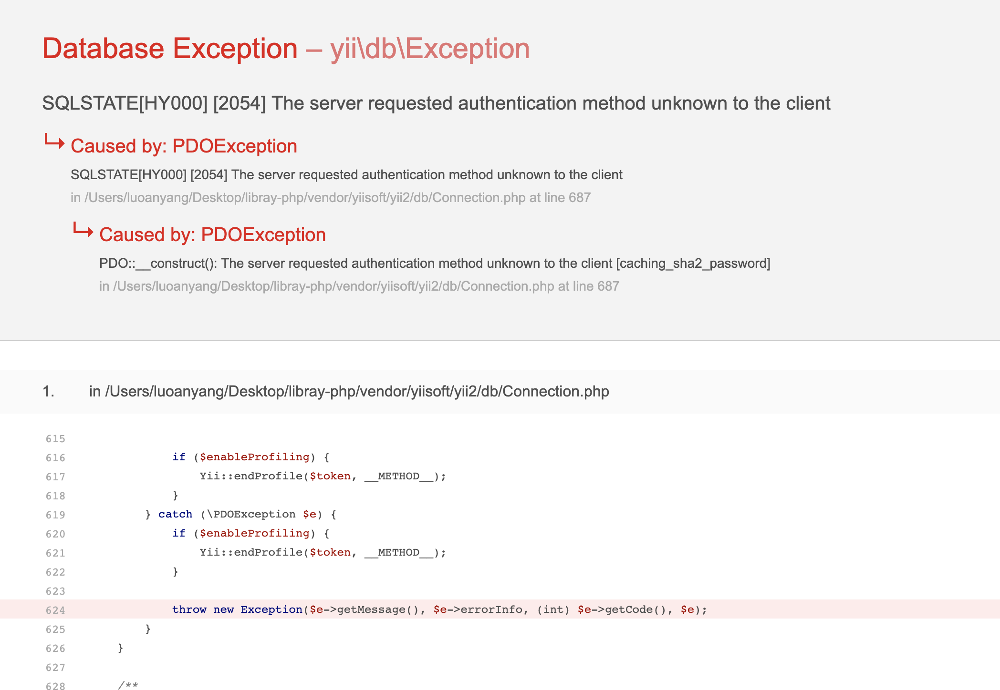
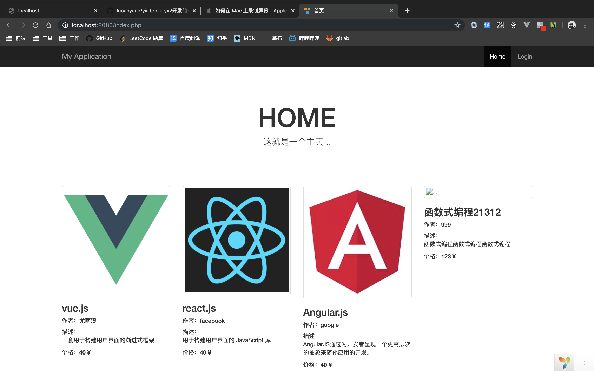
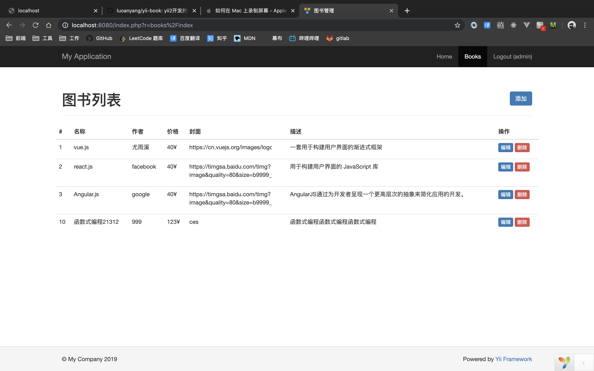

# **YII 开发的简单一个图书管理系统** 

## **1.先执行mysql语句创建图书表**
```
  CREATE TABLE `db`.`books` (
    `id` INT NOT NULL AUTO_INCREMENT,
    `name` VARCHAR(45) NOT NULL,
    `price` VARCHAR(45) NULL,
    `author` VARCHAR(45) NULL,
    `imgUrl` VARCHAR(400) NOT NULL COMMENT '图书封面',
    `description` VARCHAR(300) NULL,
    PRIMARY KEY (`id`));
```
## **2.修改连接数据库配置**
打开 config -> db.php 文件，设置数据库帐号密码

## **3.下载依赖**
在项目更目录的命令行输入：
> compose install

## **3.启动服务**
在项目更目录的命令行输入：
> php yii serve

## **4.打开浏览器**
1.打开地址： http://localhost:8080/index.php?r=site%2Flogin

2.账号：admin  密码：admin


## 注意事项
如果提示下图错误，可能是mysql8新的加密方式的原因。


在 /usr/local/etc/my.cnf 文件中,加入下面这行。
```
default_authentication_plugin=mysql_native_password
```

**必须新建一个账号，不然用之前的还是用不了，记得改 config/db.php配置**
https://faceghost.com/article/515681


## 效果

